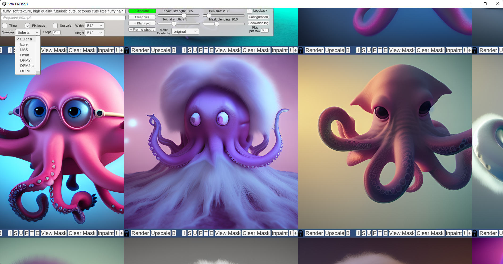
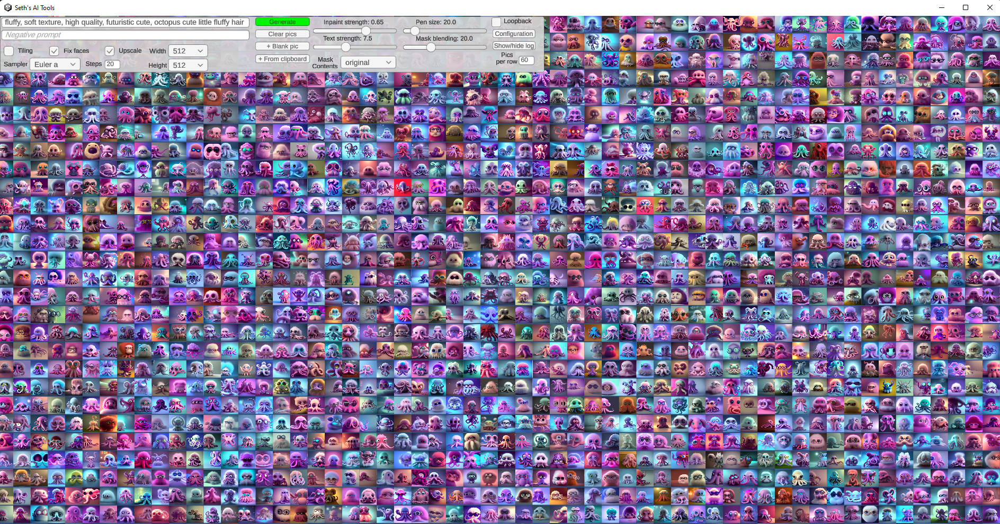
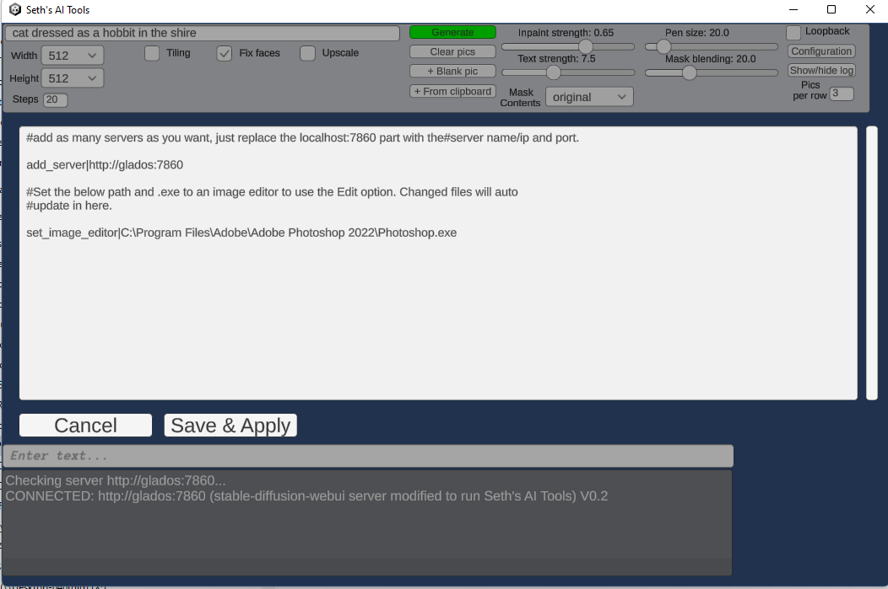

# AI Tools Server

<a href="https://www.youtube.com/watch?v=2TB4f8ojKYo"></a>

(warning, version in the video above is outdated, but does give an idea of the workflow)

# Features of this server
This is a forked version of the [AUTOMATIC1111/stable-diffusion-webui](https://github.com/AUTOMATIC1111/stable-diffusion-webui) project with api support added.

To use my native Unity-based front-end [Seth's AI Tools](https://github.com/SethRobinson/aitools_client), you need this running somewhere.

* Our api (txt2img, img2img, interrogate) can be used simultaneously with the normal web interface, AND the new half-done sdapi feature
* Just want the api and don't care about my front end? Here's a [notebook](https://github.com/SethRobinson/aitools_server/blob/master/aitools/api_tester_jupyter_notebook.ipynb) showing how to use it directly
* Also added a notebook showing how to use the new unfinished API [here](https://github.com/SethRobinson/aitools_server/blob/master/aitools/new_api_tester_jupyter_notebook.ipynb)


# Features of the AI Tools Client:
<p float="left">
<a href="aitools/ai_tools_birdy_to_bird.jpg"></a>
<a href="aitools/aitools_client_fluffy_zoomedin.jpg"></a>
</p>

 * It's not a web app, it's a native .exe
 * Photoshop/image editor integration with live update
 * text to image, inpainting, image interrogation, face fixing, upscaling, tiled texture generation with preview
 * Drag and drop images in as well as paste images from windows clipboard
 * Pan/zoom with thousands of images on the screen
 * Mask painting with controllable brush size
 * Can utilize multiple servers allowing seamless use of all remote GPUs for ultra fast generation
 * All open source, use the Unity game engine and C# to do stuff with AI art
 * Neat workflow that allows evolving images with loopback while live-selecting the best alteratives to shape the image in real-time
 

<a href="aitools/aitools_client_fluffy_zoomedout.jpg"></a>

**Note:**  This repository was deleted and replaced with the [AUTOMATIC1111/stable-diffusion-webui](github.com/AUTOMATIC1111/stable-diffusion-webui/wiki/Install-and-Run-on-AMD-GPUs) fork Sept 19th 2022, it has completely replaced the original AI Tools backend server. 

# Latest server changes (Oct 21th, 2022)
* Note, AUTOMATIC1111 now has an official half done API support, yay.  However, because it doesn't support img2img or interrogation yet, we still need our "legacy api".  I've setup all three (legeacy api, new api, and webui) to work at the same time to make this switchover process go smoother so there is no rush.  When the official API is mature, we'll probably move to it.
* Supports the new 1.5 checkpoints (inpainting one too)


## Installation and Running (modified from [stable-diffusion-webui](https://github.com/AUTOMATIC1111/stable-diffusion-webui/wiki) docs)
Make sure the required [dependencies](https://github.com/AUTOMATIC1111/stable-diffusion-webui/wiki/Dependencies) are met and follow the instructions available for both [NVidia](https://github.com/AUTOMATIC1111/stable-diffusion-webui/wiki/Install-and-Run-on-NVidia-GPUs) (recommended) and [AMD](https://github.com/AUTOMATIC1111/stable-diffusion-webui/wiki/Install-and-Run-on-AMD-GPUs) GPUs.


### Automatic Installation on Windows
1. Install [Python 3.10.6](https://www.python.org/downloads/windows/), checking "Add Python to PATH"
2. Install [git](https://git-scm.com/download/win).
3. Download the aitools_server repository, for example by running `git clone https://github.com/SethRobinson/aitools_server.git`.
4. Place `model.ckpt` in the `models` directory (see [dependencies](https://github.com/AUTOMATIC1111/stable-diffusion-webui/wiki/Dependencies) for where to get it).
5. Run `webui-user.bat` from Windows Explorer as normal, non-administrator, user.

### Automatic Installation on Linux
1. Install the dependencies:
```bash
# Debian-based:
sudo apt install wget git python3 python3-venv
# Red Hat-based:
sudo dnf install wget git python3
# Arch-based:
sudo pacman -S wget git python3
```
2. To install in `/home/$(whoami)/aitools_server/`, run:
```bash
bash <(wget -qO- https://raw.githubusercontent.com/SethRobinson/aitools_server/master/webui.sh)
```

## Adding a necessary file (needed for Win/linux installs)

4. Place `model.ckpt` in the base aitools_server directory (see [dependencies](https://github.com/AUTOMATIC1111/stable-diffusion-webui/wiki/Dependencies) for where to get it).
5. Run the server from shell with:
```bash
python launch.py --listen --port 7860 --api
```

## Google Colab

Don't have a strong enough GPU or want to give it a quick test run without hassle?  No problem, use this [Colab notebook](https://colab.research.google.com/drive/14FT8N_MfKNBmbPi4-xlt2YvrRzK1UN8K).  (Works fine on the free tier)

## How to update an existing install of the server to the latest version

Go to its directory (probably aitools_server) in a shell or command prompt and type:

```bash
git pull
```

## Running Seth's AI Tools front end

Verify the server works by visiting it with a browser.  You should be able to generate and paint images via the default web gradio interface. Now you're ready to use the native client.

**Note** The first time you use the server, it may appear that nothing is happening - look at the server window/shell, it's probably downloading a bunch of stuff.  This only happens the first time!

* [Download the Client (Windows, 22 MB)](https://www.rtsoft.com/files/SethsAIToolsWindows.zip) (Or get the [Unity source](https://github.com/SethRobinson/aitools_client))
    
* Unzip somewhere and run aitools_client.exe

The client should start up.  If you click "Generate", images should start being made.  By default it tries to find the server at localhost at port 7860.  If it's somewhere else, you need to click "Configure" and edit/add server info.  You can add/remove multiple servers on the fly while using the app. (all will be utilitized simultaneously by the app)

<a href="aitools/aitools_server_setup.png"></a>

## Using multiple GPUs on the same computer

You can run multiple instances of the server from the same install.

Start one instance:

```CUDA_VISIBLE_DEVICES=0 python launch.py --listen --port 7860 --api```

Then from another shell start another specifying a different GPU and port:

```CUDA_VISIBLE_DEVICES=1 python launch.py --listen --port 7861 --api```

Then on the client, click Configure and edit in an add_server command for both servers.

## Credits
- Seth's AI Tools created by Seth A. Robinson (seth@rtsoft.com) twitter: @rtsoft - [Codedojo](https://www.codedojo.com), Seth's blog
- The original [stable-diffusion-webui project](https://github.com/AUTOMATIC1111/stable-diffusion-webui) the server portion is forked from
- Stable Diffusion - https://github.com/CompVis/stable-diffusion, https://github.com/CompVis/taming-transformers
- k-diffusion - https://github.com/crowsonkb/k-diffusion.git
- GFPGAN - https://github.com/TencentARC/GFPGAN.git
- CodeFormer - https://github.com/sczhou/CodeFormer
- ESRGAN - https://github.com/xinntao/ESRGAN
- SwinIR - https://github.com/JingyunLiang/SwinIR
- Swin2SR - https://github.com/mv-lab/swin2sr
- LDSR - https://github.com/Hafiidz/latent-diffusion
- Ideas for optimizations - https://github.com/basujindal/stable-diffusion
- Doggettx - Cross Attention layer optimization - https://github.com/Doggettx/stable-diffusion, original idea for prompt editing.
- InvokeAI, lstein - Cross Attention layer optimization - https://github.com/invoke-ai/InvokeAI (originally http://github.com/lstein/stable-diffusion)
- Rinon Gal - Textual Inversion - https://github.com/rinongal/textual_inversion (we're not using his code, but we are using his ideas).
- Idea for SD upscale - https://github.com/jquesnelle/txt2imghd
- Noise generation for outpainting mk2 - https://github.com/parlance-zz/g-diffuser-bot
- CLIP interrogator idea and borrowing some code - https://github.com/pharmapsychotic/clip-interrogator
- Idea for Composable Diffusion - https://github.com/energy-based-model/Compositional-Visual-Generation-with-Composable-Diffusion-Models-PyTorch
- xformers - https://github.com/facebookresearch/xformers
- DeepDanbooru - interrogator for anime diffusers https://github.com/KichangKim/DeepDanbooru
- Initial Gradio script - posted on 4chan by an Anonymous user. Thank you Anonymous user.
- (You)
